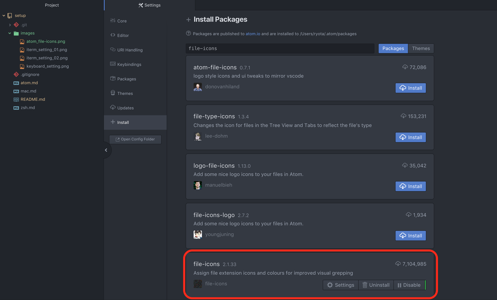
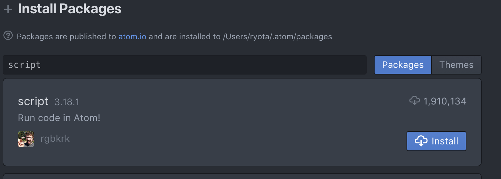
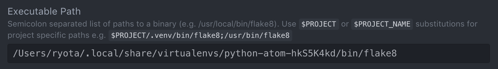

# Atom設定メモ

## 必要なもの
- Mac
    - 特になし
- Linux
    - 特になし

## やること
- [install Atom](#install-Atom)
- [install file-icons](#install-file-icons)
- [install script](#install-script)
- [install atom-beautify](#install-atom-beautify)
- [install linter](#install-linter)
- install atom-ide-ui
- install ide-python
- [for python](#for-python)

## install Atom

### Macの場合
[Atom](https://atom.io/)をダウンロード. 展開した`Atom.app`を`/Applications/`に配置.

GitHub連携とかはやらなくてもいい, Gitタブだけでもかなり便利.

## install file-icons
[file-icons](https://atom.io/packages/file-icons)

各ファイルのアイコンをかわいくしてくれる.

```
$ apm install file-icons
```

または

`Preferences -> Install -> Packages`で`file-icons`を検索. いっぱい出てくるけど画像のものをInstall.



## install script
[script](https://atom.io/packages/script)

Atom上でファイルを実行してくれる.

```
$ apm install script
```

`Preferences -> Install -> Packages`で`script`を検索. たぶん一番上にくるやつをInstall.



実行したいファイルを開いた状態で`⌘I`を押すと実行される.

内部的にはファイルの拡張子から推測した実行コマンド(.pyなら`python`)を選んでいるっぽい. pythonの仮想環境を有効にするのはちょいめんどくさいかも

## install atom-beautify
[atom-beautify](https://atom.io/packages/atom-beautify)

コードを自動整形してくれる. 言語ごとに追加で必要なBeautifiersを入れる必要がある. 詳しくは公式を参照.

```
$ apm install atom-beautify
```

`Ctrl+Option+B`でコードを整形してくれる.

## install linter
[Linter](https://atom.io/packages/linter)

文法エラーを指摘してくれる. 言語ごとに追加のPackageを入れる必要あり.

```
$ apm install linter
```

## install atom-ide-ui
注意
[atom-ide-ui](https://atom.io/packages/atom-ide-ui)

AtomをIDEっぽく使えるようにしてくれる. 各言語のideを追加で入れる必要あり.

```
$ apm install atom-ide-ui
```

もしかしたらlinterとかbeautifierと衝突するかもなので慎重に使っていく.

## for python
pythonを気持ちよく使うための設定.

### setup script
scriptでpythonを実行するときのインタプリタを設定する.

`Preferences -> Open Config Folder`から,
`~/.atom/packages/script/lib/grammars/python.coffee`を編集.

```
exports.Python =
  'Selection Based':
    #command: 'python' # この行を
    command: '/Users/ryota/.local/share/virtualenvs/python-atom-hkS5K4kd/bin/python' # 使いたいpythonのパスに変更
    args: (context) -> ['-u', '-c', context.getCode()]

  'File Based':
    #command: 'python' # 同様に
    command: '/Users/ryota/.local/share/virtualenvs/python-atom-hkS5K4kd/bin/python' # 使いたいpythonのパスに変更
    args: ({filepath}) -> ['-u', filepath]

exports.MagicPython = exports.Python

exports.Sage =
  'Selection Based':
    command: 'sage'
    args: (context) -> ['-c', context.getCode()]

  'File Based':
    command: 'sage'
    args: ({filepath}) -> [filepath]
```

これで`⌘+I`したときに指定したpythonが動くはず.

### install linter-flake8
[linter-flake8](https://atom.io/packages/linter-flake8)

flake8をAtomで使うためのパッケージ.
```
$ apm install linter-flake8
```

Atomを再起動後, `Preferences -> Packages -> linter-flake8 -> settings -> Executable Path`を編集.

flake8がインストールされているパスを記述.

```
$ cd ~/python-atom
$ pipenv shell
$ which flake8
/Users/ryota/.local/share/virtualenvs/python-atom-hkS5K4kd/bin/flake8 # ここで出力されるパスを記述
```



### setup atom-beautify
autopep8とisortのパスを通す.

`Preferences -> Packages -> atom-beautify -> settings -> Executables -> autopep8/isort`を編集.

```
$ cd ~/python-atom
$ pipenv shell
$ which autopep8
/Users/ryota/.local/share/virtualenvs/python-atom-hkS5K4kd/bin/autopep8
$ which isort
/Users/ryota/.local/share/virtualenvs/python-atom-hkS5K4kd/bin/isort
```


### install ide-python
[ide-python](https://atom.io/packages/ide-python)

atom-ide-uiをpythonに対応させてくれる.

```
$ apm install ide-python
```

linterとかと競合するのでよく考えて使う.
## future
どんどん足していきたい
