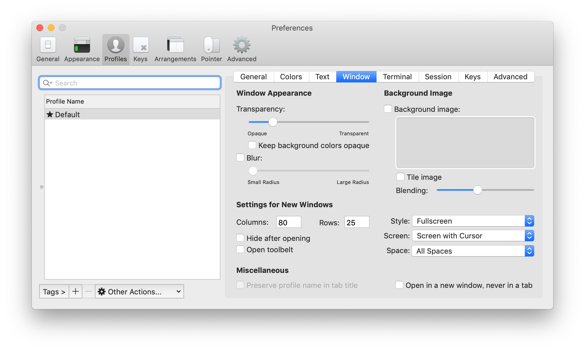

# Macの設定周りのメモ

## 必要なもの
- Mac本体

## やること
- [keyboard setting](#keyboard-setting)
- [install brew](#install-brew)
- [install CheatSheet](#install-CheatSheet)
- [install iTerm2](#install-iTerm2)
- [install Iceberg](#install-Iceberg)

## keyboard setting

`システム環境設定 -> キーボード`

`キーのリピート`, `リピート入力認識までの時間`をどちらも右にフルスイング


## install brew

[Xcode](https://apps.apple.com/jp/app/xcode/id497799835?mt=12)を落としてくる. さらにターミナルを開いて
```
$ xcode-select --install
```

rubyスクリプトを動かす.
```
$ /usr/bin/ruby -e "$(curl -fsSL https://raw.githubusercontent.com/Homebrew/install/master/install)"
```
上記コマンドを打ってもいいし, 心配なら[公式](https://brew.sh/)のコマンドを打つ. 以上問題なければ
```
$ brew doctor
```
でbrewがちゃんとインストールされているか確認できる.

## install CheatSheet

[CheatSheet](https://www.cheatsheetapp.com/CheatSheet/)をダウンロード.

`CheatSheet_version.dmg`を展開して以降は画面に従えばOK.

`⌘`キー長押しでCheatSheetが開くようになる.

## install iTerm2

[iTerm2](https://www.iterm2.com/)をダウンロード. zipを開いて生成される`iTerm.app`を`/Applications`に移動し, そのまま起動.

`iTerm2 -> Preferences -> General -> Window -> Native full screen windows`のチェックを解除する.


`iTerm2 -> Preferences -> Profiles -> Window -> Settings for new  windows`を

`Styles: Fullscreen, Screen: screen with Cursor, Space: All Spaces`に設定.



おそらく`Ctrl`キー2回タップでiTermが立ち上がるはず.

## install Iceberg

まずはデフォルトのターミナルから.

[Iceberg for macOS](http://cocopon.github.io/iceberg.vim/#macosTerminalApp)をダウンロードしてzipを解凍.

`ターミナル -> 環境設定 -> プロファイル -> 左下⚙ -> 読み込む`から, `Iceberg.terminal`を選択し, デフォルトに設定する.

`ターミナル -> 環境設定 -> プロファイル -> テキスト -> 背景 -> カラーとエフェクト`から
`不透明度: 80%, ブラー: 0%`に設定.

次にiTerm.

Iceberg-iTerm2をgit clone

```
$ git clone https://github.com/Arc0re/Iceberg-iTerm2
```

`iTerm2 -> Preferences -> Profiles -> Colors -> Color Presets... -> Import...`から, `[cloneしてきたIceberg-iTerm2]/iceberg.itermcolors`を選択.

## future
なんかいいのあったら足していこう
